# Pill Dispenser V3 - Complete Mermaid Diagrams

Generated from actual codebase analysis on December 10, 2025

---

## 1. SYSTEM ARCHITECTURE DIAGRAM

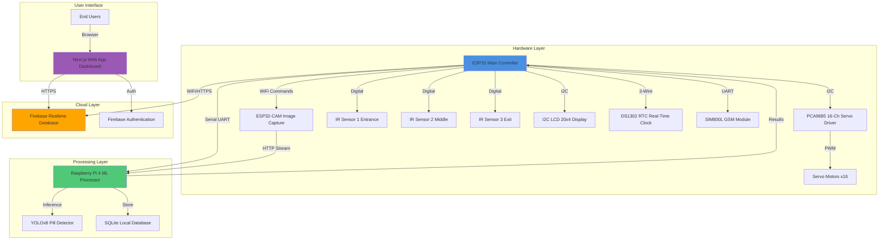

---

## 2. SYSTEM BLOCK DIAGRAM

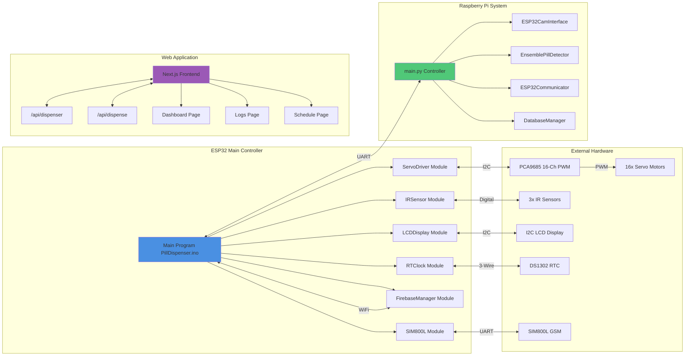

---

## 3. PROGRAM FLOWCHART - ESP32 Main

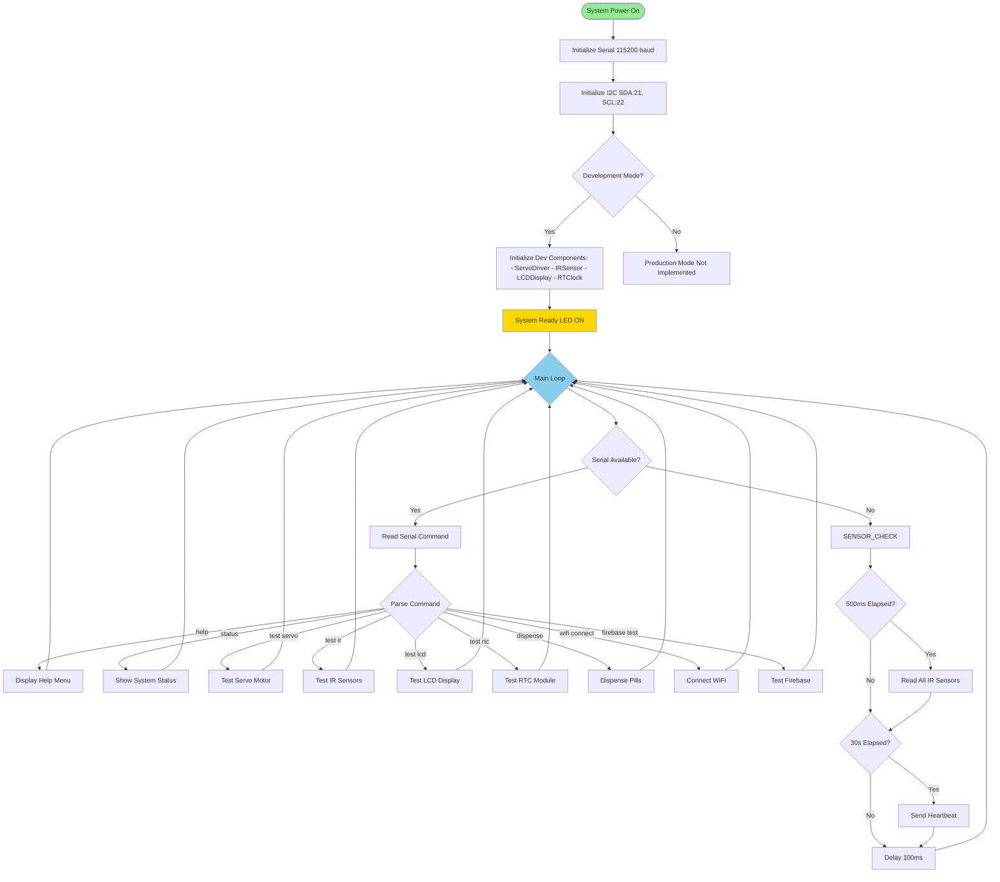

---

## 4. ACTIVITY DIAGRAM - Pill Dispensing Process

```mermaid
stateDiagram-v2
    [*] --> Idle
    
    Idle --> IRDetection: "User Request or\nScheduled Time"
    
    IRDetection --> ServoActivation: "Pills Detected at\nEntrance (IR1)"
    
    ServoActivation --> DispensePills: "Activate Servo Pair\n(Open/Close)"
    
    DispensePills --> MiddleCheck: Pills Moving
    
    MiddleCheck --> ExitCheck: IR2 Triggered
    
    ExitCheck --> CaptureImage: "IR3 Triggered\n(Exit Detection)"
    
    CaptureImage --> RPiTrigger: "Send UART Trigger\nto Raspberry Pi"
    
    RPiTrigger --> ImageCapture: "RPi Captures\n3 Images via ESP32-CAM"
    
    ImageCapture --> MLInference: "YOLOv8 Ensemble\nDetection"
    
    MLInference --> CountVerify: "Pill Count &\nClassification"
    
    CountVerify --> ResultSend: "Send Results to\nESP32 via UART"
    
    ResultSend --> LCDUpdate: "Update LCD Display"
    
    LCDUpdate --> FirebaseLog: Log to Firebase
    
    FirebaseLog --> DatabaseStore: Store in SQLite
    
    DatabaseStore --> Idle: Process Complete
    
    state IRDetection {
        [*] --> MonitorIR1
        MonitorIR1 --> IR1Blocked: Object Detected
        IR1Blocked --> [*]: Confirmed
    }
    
    state MLInference {
        [*] --> Image1
        Image1 --> Image2
        Image2 --> Image3
        Image3 --> Ensemble
        Ensemble --> [*]: Aggregated Result
    }
```

---

## 5. SEQUENCE DIAGRAM - Complete Pill Dispense Flow

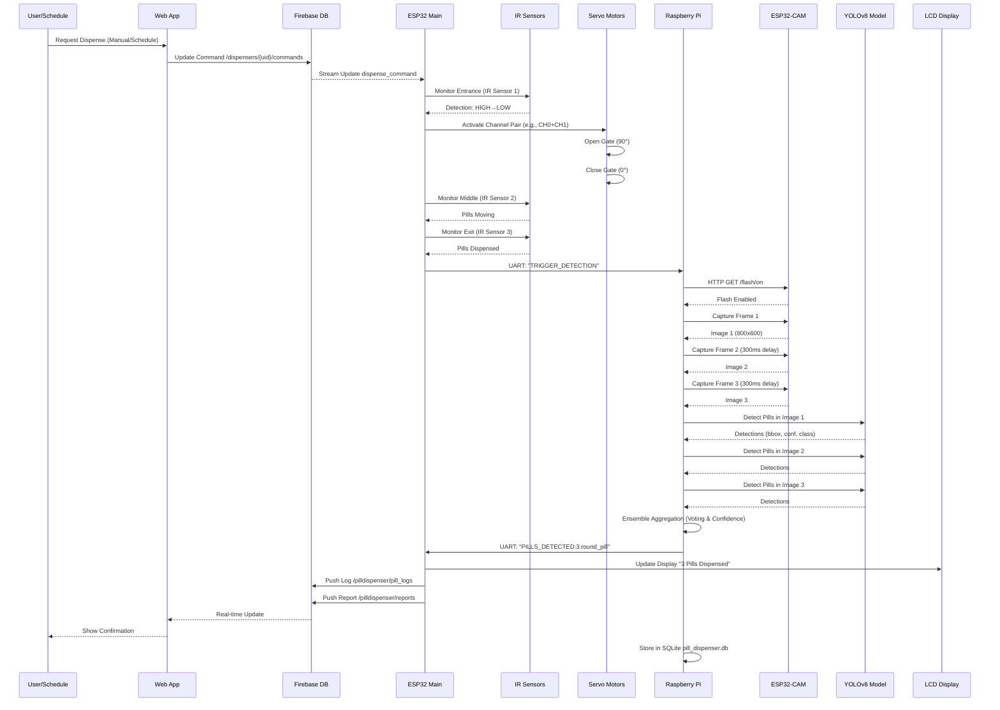

---

## 6. USE CASE DIAGRAM

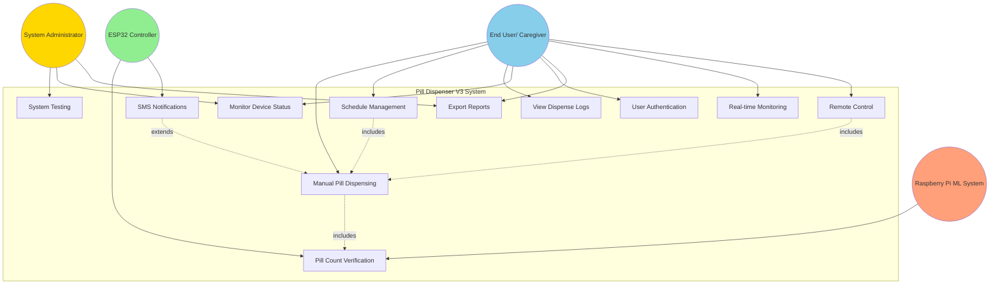

---

## 7. DATABASE SCHEMA DIAGRAM - Firebase Realtime Database

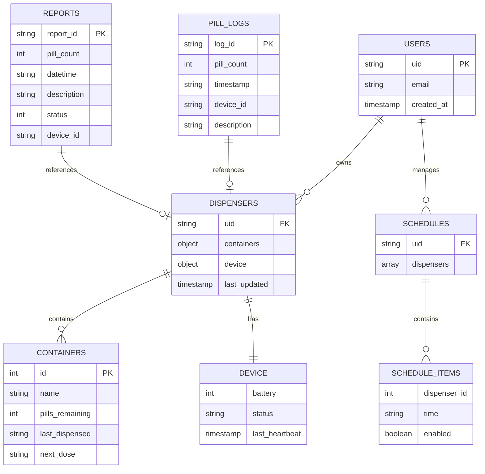

---

## 8. DATABASE SCHEMA DIAGRAM - SQLite (Raspberry Pi)

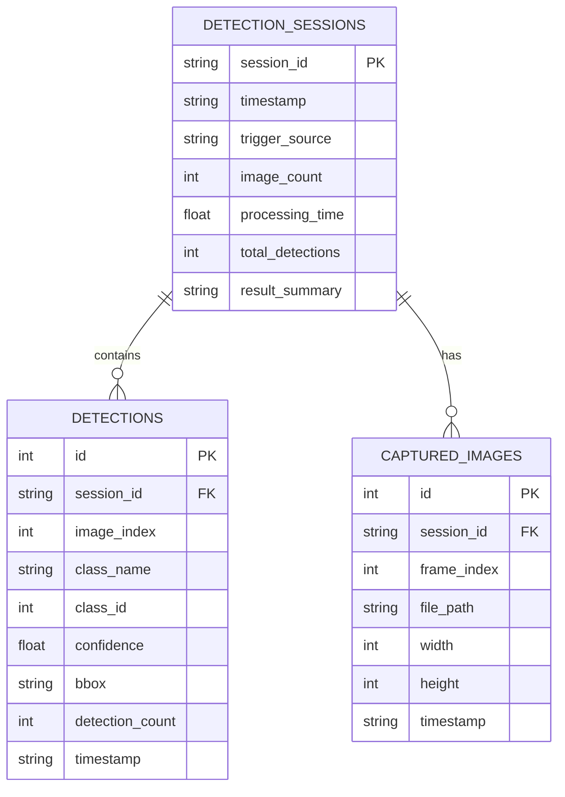

---

## 9. NETWORK/COMMUNICATION DIAGRAM

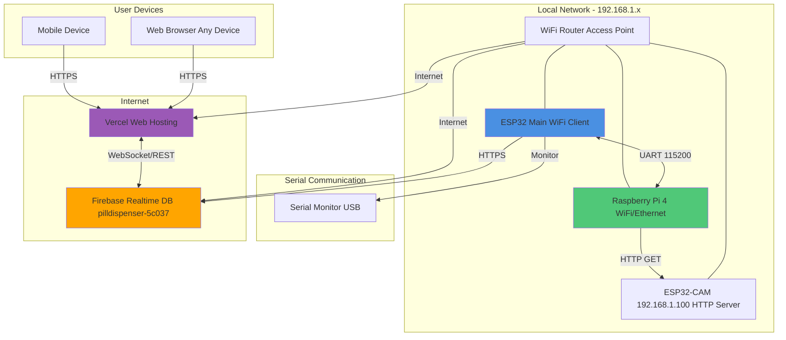

---

## 10. WEB APPLICATION FLOWCHART

```mermaid
flowchart TD
    START([User Access localhost:3000]) --> AUTH_CHECK{Firebase Configured?}
    
    AUTH_CHECK -->|No| SETUP_MSG[Show Setup Required Message]
    AUTH_CHECK -->|Yes| LOGIN_CHECK{User Logged In?}
    
    LOGIN_CHECK -->|No| LOGIN_PAGE[Login Page]
    LOGIN_CHECK -->|Yes| DASHBOARD
    
    LOGIN_PAGE --> LOGIN_FORM[Enter Email & Password]
    LOGIN_FORM --> AUTH_SUBMIT{Submit Credentials}
    
    AUTH_SUBMIT -->|Success| DASHBOARD[Dashboard Page]
    AUTH_SUBMIT -->|Failed| ERROR[Show Error Message]
    ERROR --> LOGIN_PAGE
    
    DASHBOARD --> LOAD_DATA{Load Data from Firebase}
    
    LOAD_DATA --> DEVICE_STATUS["Get Device Status /dispensers/{uid}/device"]
    LOAD_DATA --> CONTAINERS["Get Containers /dispensers/{uid}/containers"]
    
    DEVICE_STATUS --> DISPLAY_DEVICE[Display: - Battery % - Online/Offline - Low Pills Count]
    
    CONTAINERS --> DISPLAY_CONTAINERS[Display 5 Containers: - Pills Remaining - Next Dose - Last Dispensed]
    
    DISPLAY_DEVICE --> USER_ACTION{User Action?}
    DISPLAY_CONTAINERS --> USER_ACTION
    
    USER_ACTION -->|Dispense Now| DISPENSE_CHECK{Device Online?}
    USER_ACTION -->|View Logs| LOGS_PAGE[Logs Page]
    USER_ACTION -->|Manage Schedule| SCHEDULE_PAGE[Schedule Page]
    USER_ACTION -->|Logout| LOGOUT[Sign Out]
    
    DISPENSE_CHECK -->|Yes| UPDATE_FB[Update Firebase: - Decrement pills - Set timestamp]
    DISPENSE_CHECK -->|No| DISABLED[Button Disabled]
    
    UPDATE_FB --> REALTIME_UPDATE[Real-time Update via onValue()]
    REALTIME_UPDATE --> DASHBOARD
    
    LOGS_PAGE --> LOAD_LOGS[Load pill_logs & reports]
    LOAD_LOGS --> FILTER{Filter/Search}
    FILTER --> EXPORT{Export CSV?}
    EXPORT -->|Yes| DOWNLOAD_CSV[Download Logs.csv]
    EXPORT -->|No| LOGS_PAGE
    
    SCHEDULE_PAGE --> SELECT_CONTAINER[Select Container 1-5]
    SELECT_CONTAINER --> MANAGE_TIMES[Add/Edit/Remove Schedule Times Max 3 per day]
    MANAGE_TIMES --> SAVE_SCHEDULE["Save to Firebase /schedules/{uid}"]
    SAVE_SCHEDULE --> SCHEDULE_PAGE
    
    LOGOUT --> LOGIN_PAGE
    
    style START fill:#90EE90
    style DASHBOARD fill:#87CEEB
    style LOGS_PAGE fill:#FFD700
    style SCHEDULE_PAGE fill:#FFA07A
```

---

## 11. COMPONENT INTERACTION DIAGRAM - ESP32

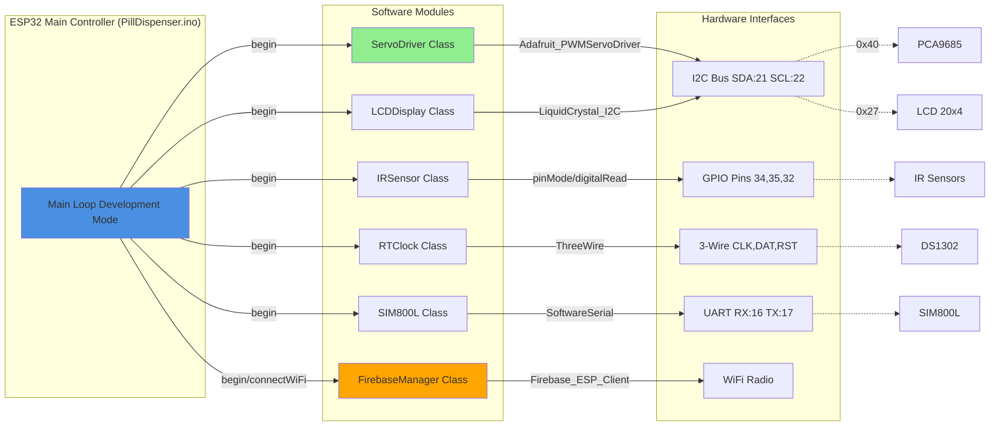

---

## 12. DATA FLOW DIAGRAM - ML Detection Pipeline

```mermaid
flowchart TD
    TRIGGER[ESP32 Trigger UART Command] --> RPI_RECV[Raspberry Pi Receives Trigger]
    
    RPI_RECV --> FLASH_ON[HTTP Request ESP32-CAM Flash ON]
    
    FLASH_ON --> CAP1["Capture Image 1 HTTP GET /stream"]
    CAP1 --> SAVE1["Save to captured_images/"]
    
    SAVE1 --> DELAY1[Delay 300ms]
    DELAY1 --> CAP2[Capture Image 2]
    CAP2 --> SAVE2[Save Image 2]
    
    SAVE2 --> DELAY2[Delay 300ms]
    DELAY2 --> CAP3[Capture Image 3]
    CAP3 --> SAVE3[Save Image 3]
    
    SAVE3 --> FLASH_OFF[Flash OFF]
    
    FLASH_OFF --> PROC1[YOLOv8 Inference Image 1]
    PROC1 --> DET1[Detections 1: bbox, conf, class]
    
    FLASH_OFF --> PROC2[YOLOv8 Inference Image 2]
    PROC2 --> DET2[Detections 2]
    
    FLASH_OFF --> PROC3[YOLOv8 Inference Image 3]
    PROC3 --> DET3[Detections 3]
    
    DET1 --> ENSEMBLE[Ensemble Aggregation]
    DET2 --> ENSEMBLE
    DET3 --> ENSEMBLE
    
    ENSEMBLE --> VOTE[Spatial Grouping & Voting]
    VOTE --> CONF[Confidence Averaging]
    CONF --> FILTER[Threshold Filter 0.7 minimum]
    
    FILTER --> FINAL[Final Detection: Count & Class]
    
    FINAL --> UART_SEND[UART to ESP32: "PILLS_DETECTED:3:round_pill"]
    FINAL --> DB_SAVE[Save to SQLite: detection_sessions]
    
    UART_SEND --> ESP32_PROC[ESP32 Processing]
    DB_SAVE --> RPI_LOG[Logging Complete]
    
    style TRIGGER fill:#FFD700
    style ENSEMBLE fill:#87CEEB
    style FINAL fill:#90EE90
```

---

## 13. STATE MACHINE DIAGRAM - System States

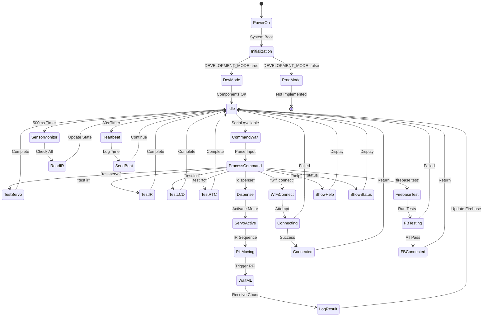

---

## 14. DEPLOYMENT DIAGRAM

```mermaid
graph TB
    subgraph "Physical Device"
        subgraph "ESP32 Node"
            ESP32_FW[ESP32 Firmware Arduino C++ PillDispenser.ino]
            ESP32_LIBS[Libraries: - Firebase_ESP_Client - Adafruit_PWMServo - LiquidCrystal_I2C]
        end
        
        subgraph "ESP32-CAM Node"
            CAM_FW[ESP32-CAM Firmware IPCamera.ino]
            CAM_SERVER[HTTP Server - /stream - /flash/*]
        end
        
        subgraph "Raspberry Pi Node"
            RPI_SW[Python Application main.py]
            RPI_DEPS[Dependencies: - ultralytics (YOLOv8) - opencv-python - pyserial - sqlite3]
            YOLO_MODEL[YOLOv8 Model pill_detector_v1.pt]
            SQLITE[SQLite Database pill_dispenser.db]
        end
    end
    
    subgraph "Cloud Infrastructure"
        subgraph "Firebase Project"
            FB_RTDB[Realtime Database pilldispenser-5c037]
            FB_AUTH[Authentication Email/Password]
        end
        
        subgraph "Vercel Platform"
            NEXT_APP[Next.js 16.0.3 Production Build]
            API_ROUTES["API Routes - /api/dispenser - /api/dispense"]
        end
    end
    
    subgraph "Development Environment"
        ARDUINO_IDE[Arduino IDE ESP32 Board Support]
        VSCODE[VS Code Python/TypeScript]
        NODE[Node.js 18+ npm packages]
    end
    
    ESP32_FW -->|Upload via USB| ARDUINO_IDE
    CAM_FW -->|Upload via USB| ARDUINO_IDE
    RPI_SW -->|Deploy| VSCODE
    NEXT_APP -->|Build & Deploy| NODE
    
    ESP32_FW <-->|WiFi/HTTPS| FB_RTDB
    NEXT_APP <-->|REST API| FB_RTDB
    NEXT_APP -->|Auth| FB_AUTH
    
    RPI_SW -->|UART| ESP32_FW
    RPI_SW -->|HTTP| CAM_FW
    RPI_SW -->|Read/Write| SQLITE
    RPI_SW -->|Inference| YOLO_MODEL
    
    style ESP32_FW fill:#4A90E2
    style RPI_SW fill:#50C878
    style NEXT_APP fill:#9B59B6
    style FB_RTDB fill:#FFA500
```

---

## 15. CLASS DIAGRAM - Core C++ Classes (ESP32)

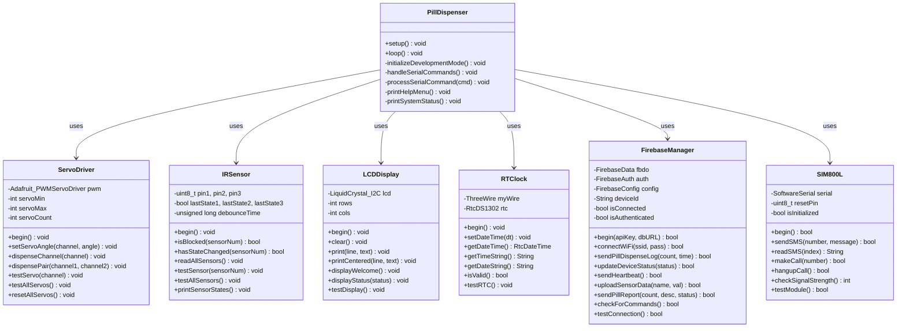

---

## 16. CLASS DIAGRAM - Python Classes (Raspberry Pi)

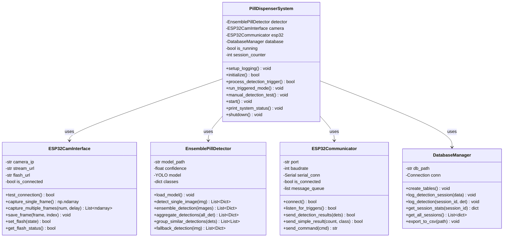

---

## 17. API ROUTE DIAGRAM - Next.js Web App

```mermaid
graph TB
    subgraph "Client Browser"
        CLIENT[React Components]
    end
    
    subgraph "Next.js API Routes"
        API_DISP["/api/dispenser GET & POST"]
        API_DISPENSE["/api/dispense POST"]
    end
    
    subgraph "Firebase Operations"
        GET_REF[ref(db, path)]
        SET_DATA[set(ref, data)]
        GET_DATA[get(ref)]
        ON_VALUE[onValue(ref, callback)]
    end
    
    subgraph "Firebase Database Paths"
        DISP_PATH["/pilldispenser/device/{deviceId}/status"]
        CONT_PATH["/pilldispenser/device/{deviceId}/dispensers"]
        DEV_PATH["/pilldispenser/device/{deviceId}"]
        SCHED_PATH["/pilldispenser/device/{deviceId}/schedules"]
        LOGS_PATH["/pilldispenser/pill_logs"]
        REP_PATH["/pilldispenser/reports"]
    end
    
    CLIENT -->|GET userId| API_DISP
    CLIENT -->|POST status, battery| API_DISP
    CLIENT -->|POST pills, userId| API_DISPENSE
    
    API_DISP -->|Read| GET_DATA
    API_DISP -->|Write| SET_DATA
    API_DISPENSE -->|Read/Write| GET_DATA
    API_DISPENSE -->|Update| SET_DATA
    
    GET_DATA --> DISP_PATH
    SET_DATA --> DISP_PATH
    GET_DATA --> CONT_PATH
    SET_DATA --> CONT_PATH
    
    CLIENT -->|Real-time| ON_VALUE
    ON_VALUE --> CONT_PATH
    ON_VALUE --> DEV_PATH
    ON_VALUE --> SCHED_PATH
    ON_VALUE --> LOGS_PATH
    ON_VALUE --> REP_PATH
    
    style CLIENT fill:#9B59B6
    style API_DISP fill:#4A90E2
    style API_DISPENSE fill:#50C878
```

---

## SUMMARY OF IMPLEMENTED FEATURES

### Hardware Layer
- ✅ ESP32 main controller with I2C, UART, GPIO
- ✅ PCA9685 16-channel servo driver
- ✅ 3 IR sensors for pill detection sequence
- ✅ I2C LCD 20x4 display
- ✅ DS1302 RTC with battery backup
- ✅ SIM800L GSM module (implemented, SMS ready)
- ✅ ESP32-CAM for image capture with flash control

### Processing Layer
- ✅ Raspberry Pi 4 with Python 3.x
- ✅ YOLOv8 machine learning model for pill detection
- ✅ Ensemble detection across 3 images
- ✅ SQLite database for local logging
- ✅ Serial UART communication with ESP32

### Cloud & Web Layer
- ✅ Firebase Realtime Database integration
- ✅ Firebase Authentication (email/password)
- ✅ Next.js 16.0.3 web application
- ✅ Real-time dashboard with 5 containers
- ✅ Schedule management (1-3 times/day per container)
- ✅ Logs page with filter/search/export
- ✅ API endpoints for hardware integration

### Communication Protocols
- ✅ I2C (LCD, PCA9685)
- ✅ UART (ESP32 ↔ RPi, SIM800L)
- ✅ WiFi (ESP32 ↔ Firebase, ESP32-CAM)
- ✅ HTTP (RPi ↔ ESP32-CAM)
- ✅ WebSocket/Real-time (Web ↔ Firebase)

---

*All diagrams generated from actual codebase implementation.*
*No imaginary or speculative features included.*
*Date: December 3, 2025*

